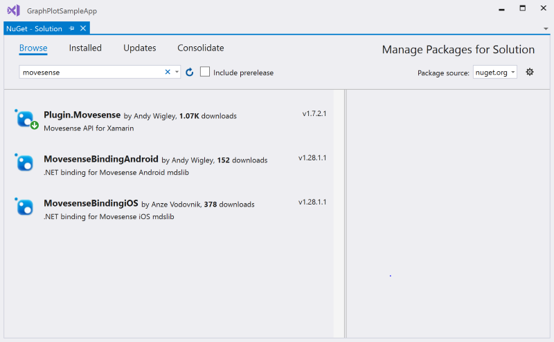
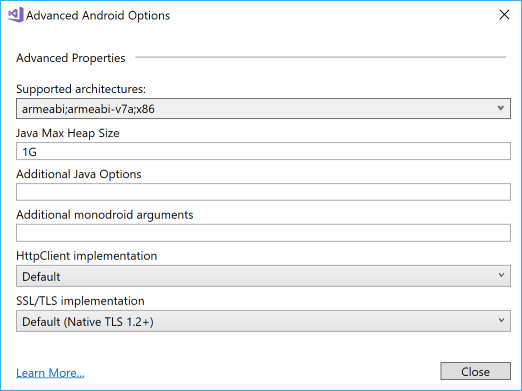

# MovesenseDotNet
Preview of Movesense .NET SDK for Xamarin Android. 
**iOS not supported yet - under development.**

## Movesense Plugin Developer Guide
The Xamarin .NET API for Movesense is available on **NuGet** as a Plugin. It is currently in preview so in NuGet Package manager, make sure you check the **Include prerelease** checkbox, then browse for *Movesense*. You should see two packages available:
  * **Plugin.Movesense** - this is the package you should reference in your project. It has the full .NET API for programming for connectivity to Movesense devices, and also includes the *MovesenseBindingAndroid* package which is the C# binding around the native Android Mdslib.aar library
  * **MovesenseBindingAndroid** - this package is the C# binding around the native Android Mdslib.aar library. You do not need to reference this package separately as it is configured as a dependency of the Plugin.Movesense package.

  

  Add the Plugin.Movesense package to all your projects: to the Xamarin Android project and also, if you are using it, to the .NET Standard project containing your shared code.

## Using the Movesense Plugin in your Xamarin Android or Xamarin Forms App
To use the Movesense Plugin in your own app:
  * Create your Xamarin Android or Xamarin Forms project
  * Add reference to the **Plugin.Movesense** NuGet package to your Xamarin Android project and - if you are using it - to your .NET Standard class library contining your shared code.
  * **IMPORTANT:** the native MdsLib.aar library that is included in the Movesense Plugin does not support 64 bit targets. Therefore, you *must* change the supported architectutes of your Xamarin Android project. To set this, go to Project Properties - Android Options, scroll down to the bottom and then click Advanced. In the Advanced Android Options window, click Supported Architectures and deselect **x86_64** and **arm64-v8a**
  * Also on the Advanced Android Options page, you may need to increase the **Java Max Heap Size** value. Suggest you set this to **1G**. If you do not set this, your compilation may fail with Memory Exceeded error.

   

  * For bluetooth connectivity, you will need to request the ACCESS_COARSE_LOCATION, BLUETOOTH and BLUETOOTH_ADMIN permissions. Check these on the Project Properties - Android manifest settings page. You will also need to request permissions from the user - see topic *Bluetooth Connections* below for information on programming connectivity to devices.
  * Access the Movesense API anywhere in your code by getting the *Plugin.Movesense.CrossMovesense.Current* property:

  ```C#
  var mds = Plugin.Movesense.CrossMovesense.Current;
  ```

  * Before you make any calls to the Movesense Plugin library, you must initialize it with the current Android Activity. For example, add a MainApplication.cs file to your project and add code similar to this:

  ```C#
    [Application]
    public class MainApplication : Application, Application.IActivityLifecycleCallbacks
    {
        public MainApplication(IntPtr handle, JniHandleOwnership transer) :base(handle, transer)
        {
        }

        ...

        public void OnActivityCreated(Activity activity, Bundle savedInstanceState)
        {
            // Initialize the MdsLib
            Plugin.Movesense.CrossMovesense.Current.Activity = activity;
        }

        ...
    }
  ```

  * To make calls to a Movesense device, you must first make a Bluetooth connection to the device. You must add this code youself as Bluetooth Connectivity is **not supported by the Movesense Plugin**. See topic *Bluetooth Connectivity* below for hints on how to do this.
  * After you have a Bluetooth connection setup, you must connect to the device using the MdsLib, passing the MAC address of the device. 
    
    Connect like this:

    ```C#
    // Make the Mds connection
    await Plugin.Movesense.CrossMovesense.Current.ConnectMdsAsync(MACAddress);
    ```

    and disconnect like this:

    ```C#
    // Disconnect from Mds
    await Plugin.Movesense.CrossMovesense.Current.DisconnectMds(MACAddress);
    ```

* Now you can make calls to the device. **Important:** All Movesense APIs require that you pass the device name as the first argument, for example *Movesense 174430000051*. This is different from the connection and disconnection to Mds described above, which uses the MAC address.
    
For example, to get device info:

```C#
var info = await Plugin.Movesense.CrossMovesense.Current.GetDeviceInfoAsync(sensor.Name);
await DisplayAlert("Success", $"Communicated with device {sensor.Name}, firmware version is: {info.DeviceInfo.Sw}", "OK");
```

* To subscribe to notifications from the builtin sensors such as the accelerometer, call the appropriate method, passing a reference to a callback function that MdsLib calls to notify data.

For example, to subscribe to Accelerometer readings:

```C#
var subscription = await Plugin.Movesense.CrossMovesense.Current.SubscribeAccelerometerAsync(
                            MovesenseDevice.Name, 
                            (d) =>
                            {
                                PlotData(d.Data.Timestamp, d.Data.AccData[0].X, d.Data.AccData[0].Y, d.Data.AccData[0].Z);
                            },
                            26);
```

To drop the subscription, simply call the Unsubscribe method of the subscription object:

```C#
subscription.Unsubscribe();
```
### Documentation
See [Movesense.NET Documentation](https://github.com/AndyCW/MovesenseDotNet/Docs/README.md) for details of the Movesense.NET API.

### Samples
See [Samples](https://github.com/AndyCW/MovesenseDotNet/src/Samples) for sample applications using Movesense.NET.

### Calling custom app resources
If you need to call a custom resource that is exposed by your own app running on a Movesense device, such as the **Hello World** sample included in the [Movesense mobile-device-lib samples](https://bitbucket.org/suunto/movesense-device-lib/src/master/samples/hello_world_app/) this is easily achieved. Simply call the **ApiCallAsync<T>** method in the Plugin.Movesense API, where T is the return type of the resource (use *string* to just return the JSON response, or define the return type in your app and pass that whereupon ApiCallAsync<T> will deserialize the JSON for you). The parameters you pass in the call to ApiCallAsync are the device name, the type of operation (GET, POST, PUT, DELETE) and the path to the resource.

For eaxample for a GET of the Hello World resource:

```C#
var helloWorldResponse = await Plugin.Movesense.CrossMovesense.Current.ApiCallAsync<string>(mSelectedDevice.Name, Plugin.Movesense.Api.MdsOp.GET, "/Sample/HelloWorld");
```

You can also use the **ApiCallAsync** method for operations that do not return a response, and you can use **ApiSubscriptionAsync<T>** for subscriptions.

See the sample [CustomServiceSample](https://github.com/AndyCW/MovesenseDotNet/src/Samples/CustomServiceSample) for an example.


## Bluetooth Connectivity
The **Movesense Plugin** does not manage Bluetooth connectivity with Movesense devices. You must implement device discovery and connection yourself. There are a number of different open source packages available to help with this. The samples in this repo use the [Plugin.BluetoothLe](https://www.nuget.org/packages/Plugin.BluetoothLE) NuGet package.

To scan for Movesense devices using *BluetoothLe*, use:

```C#
IDisposable scan = this.BleAdapter
                .Scan()
                .Subscribe(this.OnScanResult);
```

Handle discovered devices in your Subscribe callback:

```C#
        void OnScanResult(IScanResult result)
        {
            // Only interested in Movesense devices
            if (result.Device.Name != null)
            {
                if (result.Device.Name.StartsWith("Movesense"))
                {
                    // Do something with this device...
                    myDevice = result.Device;
                }
            }
        }
```

Once you have discovered a device, connect to it like this:

```C#
    myDevice.Connect();
```

After you have made the Bluetooth connection, you can make the MdsLib connection and then communicate with the device, as described in the previous section.

Disconnect Bluetooth with **CancelConnection**:

```C#
    myDevice.CancelConnection();
```

## Troubleshooting
If your app fails to start and does not report an exception, check that you have set the target architectures for your Android app to exclude 64 bit targets, as described at the beginning of section *Using the Movesense Plugin in your Xamarin Android or Xamarin Forms App* above.

