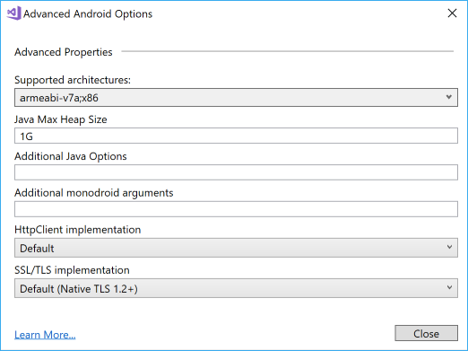

# MovesenseDotNet
Movesense .NET SDK for Xamarin Android and Xamarin iOS. Xamarin Forms supported for both shared project and shared library configurations.

**NEW RELEASE Movesense.NET V2.0.2 10 January 2019** 
  * Latest MDS Libraries supported. v1.28.1 of the Android and iOS libraries are wrapped by this plugin. Install Plugin.Movesense v2.0.1 from NuGet to get this update.
  * NEW Movesense.NET API. V2.0 of Movesense.NET introduces a slightly different API. You now get an *IMovesenseDevice* object back from a call to *ConnectMdsAsync* and you use this object thereafter to invoke other Movsense.NET operations. The old API has been deprecated, as it relied on the device name to identify the target but proved unreliable as device names may change.
  * V1.x Movesense.NET API is still supported and still fully operational, although code that calls to V1.x methods are flagged with 'Deprecated' compiler warnings.

**IMPORTANT SETUP FOR ANDROID PROJECTS for Plugin.Movesense v1.7.2.1 and later**
The latest version of the Android Mds library requires java8 features that are not supported by Xamarin tools in Visual Studio 2017. You must use Visual Studio 2019 (Preview 2) and make edits to the Xamarin.Android project file to successfully build your Xamarin Android project with this version of Plugin.Movesense. See the *Building Android Projects* instructions in the **Setup for Android projects** instructions below.

## Movesense Plugin Developer Guide
The Xamarin .NET API for Movesense is available on **NuGet** as a Plugin. If you search in NuGet Package manager for *Movesense*, you will see three packages available:
  * **Plugin.Movesense** - this is the package you should reference in your project. It has the full .NET API for programming for connectivity to Movesense devices, and also includes the *MovesenseBindingAndroid* and *MovesenseBindingiOS* packages which are the C# bindings around the native Android Mdslib.aar and iOS libmds.a libraries
  * **MovesenseBindingAndroid** - this package is the C# binding around the native Android Mdslib.aar library. You do not need to reference this package separately as it is configured as a dependency of the Plugin.Movesense package.
  * **MovesenseBindingiOS** - this package is the C# binding around the native iOS libmds.a library. You do not need to reference this package separately as it is configured as a dependency of the Plugin.Movesense package.

  

  The *only* one you need to add to your projects is the **Plugin.Movesense** package, the binding projects are defined as dependencies in the Plugin.Movesense package so will be installed automatically. Add the Plugin.Movesense package to all your projects: to the Xamarin Android and Xamarin iOS projects and also, if you are using it, to the .NET Standard project containing your shared code.

## Using the Movesense Plugin in your Xamarin App
To use the Movesense Plugin in your own app:
  * Create your Xamarin Android, Xamarin iOS or Xamarin Forms project
  * Add reference to the **Plugin.Movesense** NuGet package to your Xamarin Android and Xamarin iOS projects and - if you are using Xamarin Forms configured with common code in a class library - to your .NET Standard class library contining your shared code.

### Setup for Android projects

  * **IMPORTANT:** the native MdsLib.aar library that is included in the Movesense Plugin does not support 64 bit targets. Therefore, you *must* change the supported architectures of your Xamarin Android project. To set this, go to Project Properties - Android Options, scroll down to the bottom and then click Advanced. In the Advanced Android Options window, click Supported Architectures and deselect **x86_64** and **arm64-v8a**. [If shown, also deselect **armeabi** as this architecture is no longer supported by the Xamarin tools]
  * Also on the Advanced Android Options page, you may need to increase the **Java Max Heap Size** value. Suggest you set this to **1G**. If you do not set this, your compilation may fail with Memory Exceeded error.

    

  * For bluetooth connectivity, you will need to request the ACCESS_COARSE_LOCATION, BLUETOOTH and BLUETOOTH_ADMIN permissions. Check these on the Project Properties - Android manifest settings page. You will also need to request permissions from the user - see topic *Bluetooth Connections* below for information on programming connectivity to devices.

  * Before you make any calls to the Movesense Plugin library, you must initialize it with the current Android Activity. For example, add a MainApplication.cs file to your project and add code similar to this:

```C#
    [Application]
    public class MainApplication : Application, Application.IActivityLifecycleCallbacks
    {
        public MainApplication(IntPtr handle, JniHandleOwnership transer) :base(handle, transer)
        {
        }

        ...

        public void OnActivityCreated(Activity activity, Bundle savedInstanceState)
        {
            // Initialize the MdsLib
            Plugin.Movesense.CrossMovesense.Current.Activity = activity;
        }

        ...
    }
```

#### Building Android Projects
Plugin.Movesense v1.7.2 and later wraps the native Mdslib.aar v1.28.1 library for Android which requires java8 features that are not supported by Xamarin tools in Visual Studio 2017. 

To build your Xamarin Android project successfully using Plugin.Movesense v1.7.2 or later, you must:
  * Install [Visual Studio 2019 Preview 2](https://visualstudio.microsoft.com/vs/preview/) or later and use this to develop your app.
  * You must edit your project csproj file for your Android client project and add the following to enable the Android D8 compiler for the native code generation step:
  ```xml
  <PropertyGroup> 
    <AndroidDexTool>d8</AndroidDexTool>
  </PropertyGroup>
  ```


### Setup for iOS projects
As you are using Bluetooth peripherals, you will need to add the following to your Info.plist:

  ```xml
    <key>UIBackgroundModes</key>
    <array>
        <!--for connecting to devices (client)-->
        <string>bluetooth-central</string>

        <!--for server configurations if needed-->
        <string>bluetooth-peripheral</string>
    </array>

    <!--To add a description to the Bluetooth request message (on iOS 10 this is required!)-->
    <key>NSBluetoothPeripheralUsageDescription</key>
    <string>YOUR CUSTOM MESSAGE</string>
  ```

  ### Programming the Movesense .NET API

  * Access the Movesense API anywhere in your code by getting the *Plugin.Movesense.CrossMovesense.Current* property:

    ```C#
    var mds = Plugin.Movesense.CrossMovesense.Current;
    ```

  * To connect to a Movesense device, you must first discover a Movesense device and find out its Uuid (unique identifier). You must add this code youself as Bluetooth device discovery is **not a feature provided by the Movesense Plugin**, although once you have found a device, the Mdslib will make the Bluetooth connection when you call the *ConnectMdsAsync* method. See topic *Bluetooth Device Discovery* below for hints on how to do this.
  * After you have discovered the Uuid of a Movesense device, you must connect to it using the MdsLib, passing the Uuid of the device. 
    
    Connect like this:

    ```C#
    // Make the Mds connection
    var movesenseDevice = await Plugin.Movesense.CrossMovesense.Current.ConnectMdsAsync(sensor.Uuid);
    ```

    and disconnect using one of these options:

    ```C#
    // Disconnect from Mds - method #1
    await Plugin.Movesense.CrossMovesense.Current.DisconnectMdsAsync(sensor.Uuid);
    
    // ALTERNATIVE: Disconnect from Mds
    await movesenseDevice.DisconnectMdsAsync();
    ```

    **NOTE:** In the Movesense.NET V2 API, all Movesense APIs apart from *ConnectMdsAsync*, *ApiCallAsync* and *ApiSubscriptionAsync* are methods of the **IMovesenseDevice** object that you get back from a call to **ConnectMdsAsync**. In The V1.x API, all device-centric methods were available on the top-level *IMovesense* object and required that you pass the device **name** as the first argument, for example *Movesense 174430000051*. The V1.x API has been deprecated for the simple reason that device names can chnage so this is not a reliable way of addressing a device. The V1.x methods are still supported in V2.0 although are marked as *Deprecated* so you will get compiler warnings if you try to use them.
    
    
* The **ConnectMdsAsync** method returns an **IMovesenseDevice** object. Use this object to make calls to the device. 

    For example, to get device info:

    ```C#
    var info = await movesenseDevice.GetDeviceInfoAsync();
    await DisplayAlert("Success", $"Communicated with device {sensor.Name}, firmware version is: {info.DeviceInfo.Sw}", "OK");
    ```

* To subscribe to notifications from the builtin sensors such as the accelerometer, call the appropriate method, passing a reference to a callback function that MdsLib calls to notify data.

    For example, to subscribe to Accelerometer readings:

    ```C#
    var subscription = await movesenseDevice.SubscribeAccelerometerAsync( (d) =>
                        {
                            PlotData(d.Data.Timestamp, d.Data.AccData[0].X, d.Data.AccData[0].Y, d.Data.AccData[0].Z);
                        },
                        26);
    ```

    To drop the subscription, simply call the Unsubscribe method of the subscription object:

    ```C#
    subscription.Unsubscribe();
    ```

* To get Device connection and disconnection events, subscribe to these events on the **ConnectionLIstener** object:
  * DeviceConnected - Bluetooth LE connection has succeeded
  * DeviceConnectionComplete - connection to the Movesense Mdslib Whiteboard is complete and the device is ready for use
  * Device disconnected - device has disconnected

  Example:
  ```C#
    Plugin.Movesense.CrossMovesense.Current.ConnectionListener.DeviceDisconnected += async (s, a) =>
        {
            await DisplayAlert("Disconnection", $"Device {a.Serial} disconnected", "OK");
        };
  ```

  Note: 
  * You will receive events for all devices, so if your application connects to multiple sensors, you must examine the *MdsConnectionListenerEventArgs* to determine which device is affected. 
  * When a device disconnects, you may receive multiple **DeviceDisconnected** events.
  * If you try to use an IMovesenseDevice object when the device is disconnected, the call will return an exception.
  * After a device disconnects, MdsLib will continuously try to reconnect. If the connection is remade, you will get a **DeviceConnectionComplete** event. It is the responsibility of the application code to resubscribe to any sensor subscriptions after the device is reconnected.

### Documentation
The Movesense.NET API offers a higher level abstraction above the [REST API implemented in the native MDS libraries](https://bitbucket.org/suunto/movesense-device-lib/src/master/MovesenseCoreLib/resources/movesense-api/). It hides much of the low-level coding required to make direct REST-style API calls and offers simple to program methods to interact with most of the REST API.

**Movesense .NET API**

The Movesense API implements methods for most of the commonly used function in the Movesense API, as shown in the table below. If you need additional functions wrapping, contact us and we will implement in the next release. Alternatively, it is very easy to call functions not already implemented - see the [Custom Service Sample](https://github.com/AndyCW/MovesenseDotNet/tree/master/src/Samples/CustomServiceSample)] which shows how to call an endpoint on the Movesense Whiteboard. The sample shows how to call the *Hello World* custom resource, but the same logic applies to any of the core Movesense resources.


| Movesense .NET Method          |  Native Movesense API          | Description              |
| -------------------------------|--------------------------------|--------------------------|
|**IMovesense methods:**|||
| ConnectMdsAsync(System.Guid)   |                                | Connect to a Movesense device |
| DisconnectMdsAsync(System.Guid) |                                | Disconnect from a Movesense device |
|**IMovesenseDevice methods:**|||
| CreateLogEntry()         | [POST /Mem/Logbook/Entries](https://bitbucket.org/suunto/movesense-device-lib/src/5bcf0b40644a17d48977cf011ebcf6191650c6f0/MovesenseCoreLib/resources/movesense-api/mem/logbook.yaml#lines-138)  | Create a new log entry resource |
| DeleteLogEntries()       | [DELETE /Mem/Logbook/Entries](https://bitbucket.org/suunto/movesense-device-lib/src/5bcf0b40644a17d48977cf011ebcf6191650c6f0/MovesenseCoreLib/resources/movesense-api/mem/logbook.yaml#lines-148) | Deletes the content of the whole Logbook |
| DisconnectMdsAsync()||Disconnect from the Movesense device (alternative to IMovesense.DisconnectMdsAsync(System.Guid)|
| GetAccInfoAsync()        | [GET /Meas/Acc/Info](https://bitbucket.org/suunto/movesense-device-lib/src/5bcf0b40644a17d48977cf011ebcf6191650c6f0/MovesenseCoreLib/resources/movesense-api/meas/acc.yaml#lines-14)  | Get supported sample rates and ranges |
| GetAppInfoAsync()        | [GET /Info/App](https://bitbucket.org/suunto/movesense-device-lib/src/5bcf0b40644a17d48977cf011ebcf6191650c6f0/MovesenseCoreLib/resources/movesense-api/info.yaml#lines-23) | Query for app information |
| GetBatteryLevelAsync()   | [GET /System/Energy/Level](https://bitbucket.org/suunto/movesense-device-lib/src/5bcf0b40644a17d48977cf011ebcf6191650c6f0/MovesenseCoreLib/resources/movesense-api/system/energy.yaml#lines-14) | Get estimated battery charge level |
| GetDeviceInfoAsync()     |  [GET /Info](https://bitbucket.org/suunto/movesense-device-lib/src/5bcf0b40644a17d48977cf011ebcf6191650c6f0/MovesenseCoreLib/resources/movesense-api/info.yaml#lines-13)  | Query for device information |
| GetGyroInfoAsync()       | [GET /Meas/Gyro/Info](https://bitbucket.org/suunto/movesense-device-lib/src/5bcf0b40644a17d48977cf011ebcf6191650c6f0/MovesenseCoreLib/resources/movesense-api/meas/gyro.yaml#lines-14)  | Get supported sample rates and ranges |
| GetIMUInfoAsync()        | [GET /Meas/IMU/Info](https://bitbucket.org/suunto/movesense-device-lib/src/5bcf0b40644a17d48977cf011ebcf6191650c6f0/MovesenseCoreLib/resources/movesense-api/meas/imu.yaml#lines-14)  | Get supported sample rates and ranges |
| GetLedsStateAsync()      | [GET /Component/Leds](https://bitbucket.org/suunto/movesense-device-lib/src/5bcf0b40644a17d48977cf011ebcf6191650c6f0/MovesenseCoreLib/resources/movesense-api/component/led.yaml#lines-29) | Get leds in the system and their state (on/off & possible color) |
| GetLedStateAsync(int)  |  [GET /Component/Leds/{LedIndex}](https://bitbucket.org/suunto/movesense-device-lib/src/5bcf0b40644a17d48977cf011ebcf6191650c6f0/MovesenseCoreLib/resources/movesense-api/component/led.yaml#lines-43)  | Get state of the specific led (on/off & possible color) |
| GetLogbookDataAsync(int) | [GET /Mem/Logbook/byId/{LogId}/Data](https://bitbucket.org/suunto/movesense-device-lib/src/5bcf0b40644a17d48977cf011ebcf6191650c6f0/MovesenseCoreLib/resources/movesense-api/mem/logbook.yaml#lines-186)  | Read SBEM data from a log entry and stream it |
| GetLogbookDescriptorsAsync(int) | [GET /Mem/Logbook/byId/{LogId}/Descriptors](https://bitbucket.org/suunto/movesense-device-lib/src/5bcf0b40644a17d48977cf011ebcf6191650c6f0/MovesenseCoreLib/resources/movesense-api/mem/logbook.yaml#lines-156)  | Read training log descriptors and stream the descriptor file |
| GetLogEntriesAsync()     | [GET /Mem/Logbook/Entries](https://bitbucket.org/suunto/movesense-device-lib/src/5bcf0b40644a17d48977cf011ebcf6191650c6f0/MovesenseCoreLib/resources/movesense-api/mem/logbook.yaml#lines-111) | List Log contents |
| GetLoggerStatusAsync()   | [GET /Mem/DataLogger/State](https://bitbucket.org/suunto/movesense-device-lib/src/5bcf0b40644a17d48977cf011ebcf6191650c6f0/MovesenseCoreLib/resources/movesense-api/mem/datalogger.yaml#lines-41)  | Reads current DataLogger state |
| GetMagInfoAsync()        | [GET /Meas/Magn/Info](https://bitbucket.org/suunto/movesense-device-lib/src/5bcf0b40644a17d48977cf011ebcf6191650c6f0/MovesenseCoreLib/resources/movesense-api/meas/magn.yaml#lines-14) | Get info about the magnetometer |
| GetTimeAsync()           | [GET /Time](https://bitbucket.org/suunto/movesense-device-lib/src/5bcf0b40644a17d48977cf011ebcf6191650c6f0/MovesenseCoreLib/resources/movesense-api/time.yaml#lines-13)      | Gets current time in number of microseconds since epoch 1.1.1970 (UTC) |
| SetLedStateAsync(int, bool, LedColor)   | [PUT /Component/Leds/{LedIndex}](https://bitbucket.org/suunto/movesense-device-lib/src/5bcf0b40644a17d48977cf011ebcf6191650c6f0/MovesenseCoreLib/resources/movesense-api/component/led.yaml#lines-51) | Write new state (on/off & color) for specific led |
| SetLoggerStatusAsync(int) |  [PUT /Mem/DataLogger/State](https://bitbucket.org/suunto/movesense-device-lib/src/5bcf0b40644a17d48977cf011ebcf6191650c6f0/MovesenseCoreLib/resources/movesense-api/mem/datalogger.yaml#lines-49) | Changes DataLogger to a new state |
| SetTimeAsync()           | [PUT /Time](https://bitbucket.org/suunto/movesense-device-lib/src/5bcf0b40644a17d48977cf011ebcf6191650c6f0/MovesenseCoreLib/resources/movesense-api/time.yaml#lines-23) | Sets current time in number of microseconds since epoch 1.1.1970 (UTC) |
| SetupLoggerAsync()       | [PUT /Mem/DataLogger/Config](https://bitbucket.org/suunto/movesense-device-lib/src/5bcf0b40644a17d48977cf011ebcf6191650c6f0/MovesenseCoreLib/resources/movesense-api/mem/datalogger.yaml#lines-24)   | Writes new DataLogger config to device |
| SubscribeAccelerometerAsync(Action<AccData>, int)   | [POST /Meas/Acc/{SampleRate}/Subscription](https://bitbucket.org/suunto/movesense-device-lib/src/5bcf0b40644a17d48977cf011ebcf6191650c6f0/MovesenseCoreLib/resources/movesense-api/meas/acc.yaml#lines-57) | Subscribe to periodic linear acceleration measurements |
| SubscribeGyrometerAsync(Action<GyroData>, int)   | [POST /Meas/Gyro/{SampleRate}/Subscription](https://bitbucket.org/suunto/movesense-device-lib/src/5bcf0b40644a17d48977cf011ebcf6191650c6f0/MovesenseCoreLib/resources/movesense-api/meas/gyro.yaml#lines-53) | Subscribe to periodic gyroscope measurements |
| SubscribeIMU6Async(Action<IMU6Data>, int)   | [POST /Meas/IMU6/{SampleRate}/Subscription](https://bitbucket.org/suunto/movesense-device-lib/src/5bcf0b40644a17d48977cf011ebcf6191650c6f0/MovesenseCoreLib/resources/movesense-api/meas/imu.yaml#lines-66) | Subscribe to periodic 6-axis IMU measurements (Acc + Gyro) |
| SubscribeIMU9Async(Action<IMU9Data>, int)   | [POST /Meas/IMU9/{SampleRate}/Subscription](https://bitbucket.org/suunto/movesense-device-lib/src/5bcf0b40644a17d48977cf011ebcf6191650c6f0/MovesenseCoreLib/resources/movesense-api/meas/imu.yaml#lines-40)   | Subscribe to periodic 9-axis IMU measurements |
| SubscribeMagnetometerAsync(Action<MagnData>, int)   | [POST /Meas/Magn/{SampleRate}/Subscription](https://bitbucket.org/suunto/movesense-device-lib/src/5bcf0b40644a17d48977cf011ebcf6191650c6f0/MovesenseCoreLib/resources/movesense-api/meas/magn.yaml#lines-52) | Subscribe to periodic magnetometer measurements |


See [Movesense.NET Documentation](https://github.com/AndyCW/MovesenseDotNet/tree/master/Docs) for full details of the Movesense.NET API.

### Samples
See [Samples](https://github.com/AndyCW/MovesenseDotNet/Samples) for sample applications using Movesense.NET.

### Calling custom app resources, or REST endpoints not mapped to Movesense.NET methods
If you need to call a custom resource that is exposed by your own app running on a Movesense device, such as the **Hello World** sample included in the [Movesense mobile-device-lib samples](https://bitbucket.org/suunto/movesense-device-lib/src/master/samples/hello_world_app/) this is easily achieved. Simply call the **ApiCallAsync<T>** method in the Plugin.Movesense API, where T is the return type of the resource (use *string* to just return the JSON response, or define the return type in your app and pass that whereupon ApiCallAsync<T> will deserialize the JSON for you). The parameters you pass in the call to ApiCallAsync are the *IMovesenseDevice* object for the device, the type of operation (GET, POST, PUT, DELETE) and the path to the resource. You can use the same technique for REST endpoints not currently mapped to Movesense.NET API methods.

For example for a GET of the Hello World resource:

```C#
var helloWorldResponse = await Plugin.Movesense.CrossMovesense.Current.ApiCallAsync<string>(movesenseDevice, Plugin.Movesense.Api.MdsOp.GET, "/Sample/HelloWorld");
```

You can also use the **ApiCallAsync** method for operations that do not return a response, and you can use **ApiSubscriptionAsync<T>** for subscriptions.

See the sample [CustomServiceSample](https://github.com/AndyCW/MovesenseDotNet/Samples/CustomServiceSample) for an example.


## Bluetooth device discovery
The **Movesense Plugin** does not manage Bluetooth discovery of Movesense devices. You must implement device discovery yourself. There are a number of different open source packages available to help with this. The samples in this repo use the [Plugin.BluetoothLe](https://www.nuget.org/packages/Plugin.BluetoothLE) NuGet package.

To scan for Movesense devices using *BluetoothLe*, use:

```C#
IDisposable scan;
CrossBleAdapter.Current.WhenStatusChanged().Subscribe(status =>
    {
        if (status == AdapterStatus.PoweredOn)
        {
            scan = this.BleAdapter.Scan()
            .Subscribe(this.OnScanResult);
        }
    });
```

Handle discovered devices in your Subscribe callback:

```C#
        void OnScanResult(IScanResult result)
        {
            // Only interested in Movesense devices
            if (result.Device.Name != null)
            {
                if (result.Device.Name.StartsWith("Movesense"))
                {
                    // Do something with this device...
                    var sensor = result.Device;
                }
            }
        }
```

Once you have discovered a device, you can make the MdsLib connection and then communicate with the device, as described in the previous section.

## Troubleshooting
If your app fails to start and does not report an exception, check that you have set the target architectures for your Android app to exclude 64 bit targets, as described at the beginning of section *Setup for Android projects* above.

