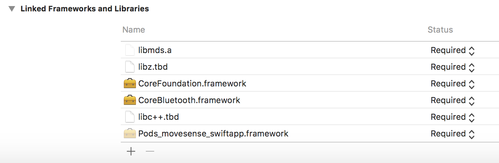
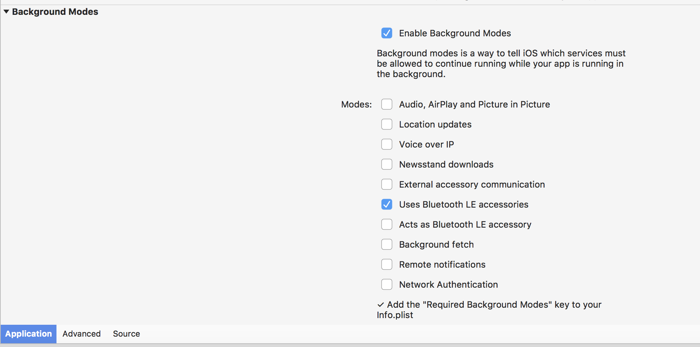

UK-DX-MacBook-Pro:Attempt5 anze$ sharpie bind -o stuff -sdk iphoneos11.3 -namespace Movesense -scope /Users/anze/temp/movesense-mobile-lib/IOS/Movesense/include/  /Users/anze/temp/movesense-mobile-lib/IOS/Movesense/include/MDS.h


# iOS Binding for Movesense

> _This post will be published on www.vodovnik.com soon_.

This document describes how to get the Movesense binding working for Xamarin, in iOS. The same approach can be taken when you need to include a (native) CocoaPods library into your Xamarin project.

We knew that to use Movesense in a Swift project, you have to install some CocoaPods containing the framework, and additionally, reference a _native_ library (libmds.a) which the pod uses for communication with the Movesense devices. To complicate things, the pod is actually located behind a private repository. While we have access to the repository, the steps to get that working as a reference of a Xamarin binding proved to not be documented anywhere.

## Sharpie

Most of the Xamarin documentation references a tool called [Objective Sharpie](https://docs.microsoft.com/en-us/xamarin/cross-platform/macios/binding/objective-sharpie/) which does indeed look like what we need. There's even some documentation available that covers the usage of Sharpie for [CocoaPods](https://docs.microsoft.com/en-us/xamarin/cross-platform/macios/binding/objective-sharpie/examples/cocoapod).

In our case, this was a bit of a problem as the CocoaPod is actually located behind a private repostitory and the documentation in no way explained how to get that working. Through trial and error, we established that sharpie init actually just creates a podfile, which meant that we could go on and fake it. We created a new `podfile` that looked something like this:

```bash
platform :ios, '11.3'
install! 'cocoapods', :integrate_targets => false

target 'ObjectiveSharpieIntegration' do
   use_frameworks!
end

# force the sub specs in the array below to use swift version 3.0
# Note: we assumed this is correct, and it was through a ton of trial and error
post_install do |installer|
    installer.pods_project.targets.each do |target|
            target.build_configurations.each do |config|
                config.build_settings['SWIFT_VERSION'] = '3.0'
        end
    end
end

pod 'Movesense', :git => 'location of the private repository'
```

From this point we ended up manually running `pod install`. After that completed, and installed all the references, we could finally run `sharpie pod bind` which took the state of the CocoaPods and created the _framework_ files we needed to reference. The first time we ran bind, it failed miserably, as we did not have the target framework limiting to `SWIFT_VERSION`. We found [this post](https://github.com/mxcl/PromiseKit/issues/722) which seemed to do the trick.

From there on, we continued to follow the [documentation](https://docs.microsoft.com/en-us/xamarin/ios/platform/binding-objective-c/walkthrough?tabs=vsmac#Create_a_Xamarin.iOS_Binding_Project).

## Creating the Binding Project

The next step was to start creating the binding project in Xamarin, that we'll later be packaging up as a NuGet project. This is the _library_ that will be consumed by applications developed in C#.

Following the documentation to create the binding project as nornmal was easy but we needed to also include a native reference to the `.framework`  folder we've created earlier. Additionally, we added a reference to the aforementioend `libmds.a` file. Because the library is _special_ we need to perform some exstra steps. Specifically, through trial and error we've found all the required frameworks that it references.

To help with this, we opened the example project in XCode. Looking at the requirements in XCode we figure out we need the following libraries:



`Security`, `CoreBluetooth` and `CoreFoundation`. But also, importantly we notice a few other things. It turns out it also references `libz.tbd` and a `libc++.tbd` which for us means setting a few extra flags. Specifically, we set the `Is C++` flag on the properties of the `libmds.a` file. This tells the linker to also include the `libc++.tbd` which is a special case. The `libz.tbd` library, though, we need to manually add a linker flag `-lz` which, as suggested by the name tells it to include the `libz` part as well.

## Creating our app using the binding

Now, we finally get to the fun part. We create a new project and reference the bindings project we've created above. We ran into multiple problems from the start, after referencing the library. Most of the initial compilation problems we've encountered went away when we disabled `incremental builds`. We also need to match the Entitlements - specifically, we will require the use of Bluetooth LE in the background.



As we wrote the first part of the library, the application ran in the emulator, but it did not run on the iPhone and kept crashing. **make sure to add more info here**.

We found an undocumented workaround through speaking with the team. Essentially, the problem is that the Swift libraries are missing. Usually, the way to fix that was to add them through NuGet, however as we soon discovered, making sure the correct versions were there, and linked correctly was not easy. In fact, it was not feasible for a library we did not write ourselves. It turns out, there are some tools within XCode that can help us with this.

To make the changes, we had to edit the project file separately/manually. Specifically, we appended the following code:

```xml
<Target Name="_ProjectSwiftMaster"
    Condition="'_SwiftDependencies'!=''"
    AfterTargets="_CodesignNativeLibraries"
    DependsOnTargets="_SwiftDependencies" />
<PropertyGroup>
<_TargetPlatform Condition=" '$(Platform)' == 'iPhoneSimulator' ">iphonesimulator</_TargetPlatform>
    <_TargetPlatform Condition=" '$(Platform)' == 'iPhone' ">iphoneos</_TargetPlatform>
</PropertyGroup>
<Target Name="_SwiftDependencies" Condition="!Exists('$(_AppBundlePath)Frameworks/libswiftCore.dylib')">
    <Message Text="Copying Swift Frameworks dependencies for %(_Frameworks.Identity) to $(_AppBundlePath)Frameworks folder" />
    <Exec Command="xcrun swift-stdlib-tool --copy --verbose --verbose --sign $(_CodeSigningKey) --scan-executable %(_Frameworks.Identity) --scan-folder $(_AppBundlePath)Frameworks/ --scan-folder $(_AppBundlePath)PlugIns/ --platform $(_TargetPlatform) --toolchain $(_XcodeToolChain) --destination $(_AppBundlePath)Frameworks/ --strip-bitcode --resource-destination $(_AppBundlePath) --resource-library libswiftRemoteMirror.dylib"/>
</Target>
```

Specifically, there's a tool call `swift-stdlib-tool` (apltly named, no?) that can be run with a different tool called `xcrun`. You can see that in the above code sample. The tool scans the given folder, given through all the `--scan-folder` flags, and picks the framework files that need to be referenced. Those are then copied over (due to the `--copy` flag) into the `/Frameworks` folder **within** the `_AppBundlePath`. So, it copies the files into the bundle that is then executed on the phone.